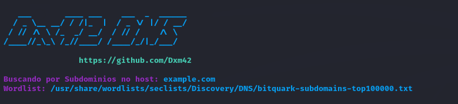

Este script realiza a enumeração de subdominions, foi implementado o sistema de fila e threads para uma execução mais rápida e eficiente.

#### Modo de uso

#### Dar permissão ao arquivo para que possa ser executado

```shell
$ chmod +x dx42_DNS.py
```

#### Executando o script

```shell
$ ./dx42_DNS.py wordlist.txt
```
